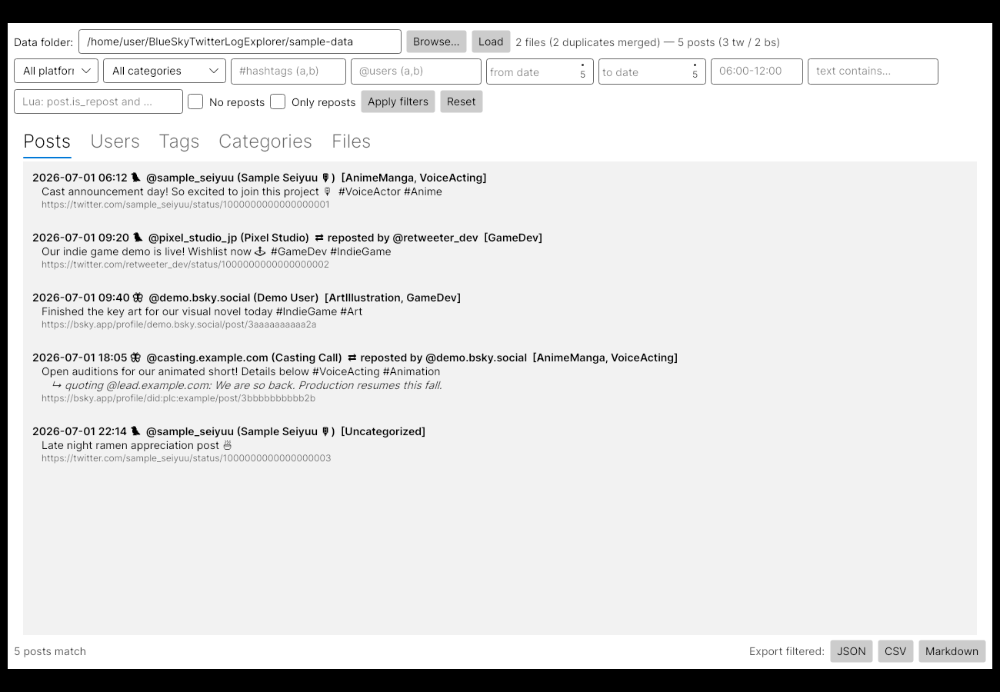
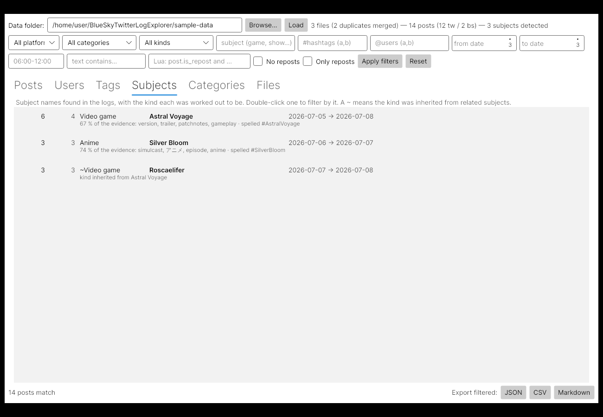

# BlueSky/Twitter Log Explorer

A desktop **GUI** (plus CLI) explorer for **Bluesky** and **Twitter/X** activity that was
mirrored into Discord (TweetShift / SkyCord bots) and exported with **DiscordLog** or
**DiscordChatExporter**. Written in **C#** (.NET 8, Avalonia UI — Windows/macOS/Linux) with
all filtering rules scripted in **Lua** (embedded via MoonSharp — no separate Lua install
needed).



It recovers the original social-media posts out of the Discord message dumps and lets you
explore them per user, per hashtag category and per date/time window:

* **Reads .7z and .zip archives directly** — drop the DiscordLog exports into a folder
  named `BlueSkyX` (as archives or extracted, mixed freely); files are streamed straight
  out of the archives, nothing is ever extracted to disk.
* **Duplicate merging** — identical copies of an export (same name and size) and
  re-exports covering the same channel and dates are merged into one entry, and the same
  post appearing in overlapping exports is counted once.
* **Every user indexed** — each Bluesky/Twitter author found in the logs, with post and
  repost counts, first/last seen dates, top hashtags and categories.
* **Subjects detected by name, with no list of titles anywhere** — the explorer works out
  which games, shows, events and so on the logs are about, and files each under a kind
  ("Video game", "Anime", …). See [Subjects and kinds](#subjects-and-kinds) below.
* **Strict hashtag filtering by category** — categories are defined in
  [`scripts/filters.lua`](scripts/filters.lua). In strict mode `#anime` matches the
  `anime` tag exactly and `#animeexpo` does not; loose mode allows prefix matching.
  Categories can also match by author handle or by an arbitrary Lua function.
* **Automatic date & time filtering** — every post gets its real post timestamp (tweet
  time, Bluesky `<t:…>` time; the Discord message time is a fallback), file date ranges
  are read from export metadata/filenames, and a default date/time window in the Lua
  script is applied automatically everywhere.

## The GUI

```bash
dotnet run --project src/LogExplorer.Gui     # or grab a prebuilt binary, see below
```

On startup the app auto-loads `./BlueSkyX` when it exists (or `$LOGEXPLORER_DATA`);
otherwise use **Browse…** to pick the folder with your exports. The filter bar applies
platform, category, hashtag, user, date range, time-of-day window, full-text and raw Lua
predicates to every tab:

* **Posts** — filtered posts with repost/quote context, categories and links.
* **Users** — every Bluesky/Twitter user with post/repost counts, activity span and top
  hashtags; double-click a user to jump to their posts.
* **Tags** — hashtag frequencies and their categories; double-click to filter by a tag.
* **Subjects** — every detected subject with its kind and the evidence behind it;
  double-click to filter by it. The *kind* dropdown and *subject* box filter every tab.
* **Categories** — the Lua categories with post/user counts and top users.
* **Files** — every export file (including ones inside archives) with format, date range
  and merge/duplicate info.
* **Export** — write whatever is currently filtered to JSON, CSV or Markdown.

## Data formats understood

| Format | What is parsed |
|---|---|
| `.7z` / `.zip` archives | Every supported file inside is streamed straight out of the archive (solid 7z included) — never extracted to disk |
| DiscordLog JSON (`{serverName, channelName, fromDate, toDate, messages}`) | Tweets from TweetShift embeds **and** Bluesky posts from Components-V2 blocks (posts, reposts, quotes) |
| DiscordChatExporter JSON (`{guild, channel, dateRange, messages}`) | Tweets from embeds (DiscordChatExporter does not capture Bluesky component content) |
| CSV / TXT / MD / HTML exports | Listed in the Files view with their date ranges (the JSON exports carry the same messages, so these are not parsed) |

Retweets are detected (TweetShift keeps the retweeter in the status URL and the original
author in the embed), Bluesky reposts/quotes are parsed from the component markup, x.com
URLs are canonicalized, and posts appearing in several overlapping exports are counted once.

## The CLI

```bash
# 1. Drop your DiscordLog .7z/.zip exports (or extracted files) into ./BlueSkyX
#    (the repo ships tiny synthetic files in ./sample-data to try it out)

# 2. Explore
dotnet run --project src/LogExplorer -- files
dotnet run --project src/LogExplorer -- users --top 25 --detail
dotnet run --project src/LogExplorer -- posts --category VoiceActing --from 2026-07-01 --to 2026-07-15
dotnet run --project src/LogExplorer -- tags  --top 50
dotnet run --project src/LogExplorer -- categories
dotnet run --project src/LogExplorer -- export --tag gamedev --format csv --out gamedev.csv
dotnet run --project src/LogExplorer -- interactive
```

`--data` defaults to `./BlueSkyX` (or `$LOGEXPLORER_DATA`); the directory is scanned
recursively and `.7z`/`.zip` archives found anywhere inside are read directly — no
extraction needed.

## Commands

| Command | Purpose |
|---|---|
| `files` | Every export file with format, platform, date range, message and parsed-post counts |
| `users` | Every Bluesky/Twitter user seen in the logs (`--sort posts\|recent\|handle`, `--top`, `--find`, `--detail`) |
| `posts` | Posts matching the filters (`--full`, `--sort old\|new`) |
| `tags` | Hashtags with counts and the categories they map to |
| `labels` | Subjects detected in the logs with their kind (`--explain` shows why, `--sort posts\|users\|name\|kind`, `--top`, `--find`) |
| `kinds` | Summary of the detected kinds and their most common subjects |
| `categories` | The Lua categories with post counts, user counts and top users |
| `export` | Write filtered posts to `json`, `csv` or `md` (`--out`, `--format`) |
| `interactive` | REPL accepting all of the above |

### Filters (work on every command)

```
--platform twitter|bluesky     --user handle1,handle2      (author or reposter)
--tag anime,gamedev            --category VoiceActing      (from filters.lua)
--label "Genshin Impact"       --kind "Video game"         (auto-detected subjects/kinds)
--from 2026-07-01              --to 2026-07-15T12:00       (UTC; bare --to date = whole day)
--last 7d|12h|30m              (measured back from the newest post in the data)
--between 06:00-12:00          (time-of-day window, may wrap midnight)
--contains "text"              --where "post.is_repost and #post.hashtags > 1"   (Lua!)
--no-reposts / --only-reposts  --limit N
```

## Subjects and kinds



Beyond the hand-written categories, the explorer figures out *what the logs are about* on its
own. No title is written down anywhere in the code or the config, so a game or show that first
appears in next month's export is picked up without anyone editing a list.

1. **Names come from the data.** Hashtags that recur often enough become subjects, with their
   spellings folded together (`#GenshinImpact`, `#genshinimpact`, `#Genshin_Impact` are one
   subject) and read back as a name — `AstralVoyage` → "Astral Voyage". A hashtag that is
   ordinary vocabulary (`#anime`, `#gamedev`) is a topic, not a title, so it never becomes a
   subject.
2. **Kinds come from how people talk.** `filters.lua` describes each kind with plain
   vocabulary — "patchnotes", "wishlist" for a video game; "episode", "simulcast" for anime —
   and a subject is filed under the kind whose vocabulary shows up in its posts. Words that
   honestly belong to several kinds ("trailer", "chapter", "season") are listed under each of
   them, so they cancel out and the telling words decide.
3. **The explorer extends the vocabulary itself.** Once some subjects are confidently placed,
   it learns which *other* words lean towards each kind and judges everything again. Subject
   names and account handles are excluded from what can be learned, so it learns language
   rather than agreeing with itself.
4. **Evidence is weighed, not just counted.** Words that fire everywhere count for little; a
   post from the subject's own account (`@AstralVoyage` posting about `#AstralVoyage`) counts
   for a lot; a post with eight hashtags stapled to it counts for less per subject; and a
   single ambiguous word never settles a kind on its own.
5. **What is left over inherits.** A subject with no vocabulary of its own takes the kind of
   the subjects it keeps appearing beside — a `~` in the listings marks those.

`labels --explain` shows the reasoning for every subject:

```
   135     60   Video game        Genshin Impact             2022-07-15 → 2026-09-01
              why: vocabulary in 56 % of its posts: traveler, version, dear, trailer
              spellings: #GenshinImpact #genshinimpact #Genshinimpact
              seen with: Sandrone, Columbina, 原神, Genshin Luna VIII, 원신
```

Every knob is in `filters.lua` — add or rename kinds, edit their vocabulary, change the
thresholds, or take the final decision yourself in a `detect(label)` function.

## The Lua side (`scripts/filters.lua`)

All filtering *rules* live in Lua; the C# side only parses and applies them:

```lua
options = {
    strict = true,             -- exact hashtag matching per category
    require_category = false,  -- drop uncategorized posts everywhere
}

date = {                       -- applied automatically when no CLI flags given
    from = "2026-07-01", to = "2026-07-31",
    time_from = "06:00", time_to = "12:00",   -- UTC time-of-day window
}

categories = {
    VoiceActing = { tags = { "voiceactor", "voiceacting", "casting" } },
    VTuber = {
        tags = { "vtuber", "nijisanji" },
        users = { "Tyrant_Vanta" },           -- handles force the category
        match = function(post)                -- arbitrary Lua per post
            return string.find(string.lower(post.text), "debut stream", 1, true) ~= nil
        end,
    },
}

function exclude(post)         -- drop posts before any other filter runs
    return post.handle == "some.spammer.bsky.social"
end

function categorize(post)      -- fallback for posts no category matched
    return nil
end

labels = {                     -- automatic subject detection (see above)
    min_posts = 3,             -- how often a hashtag must appear to count as a subject
    min_terms = 2,             -- how many different words must back a decision
    learned_terms_per_kind = 40,
    kinds = {
        ["Video game"] = { "gameplay", "patchnotes", "wishlist", "gacha", "trailer" },
        ["Anime"] = { "anime", "episode", "simulcast", "dubbed", "trailer" },
        ["Event"] = { weight = 0.35, "convention", "booth", "artistalley" },
    },
    detect = function(label)   -- optional last word on any subject
        return nil
    end,
}
```

Ad-hoc Lua predicates also work straight from the CLI:

```bash
dotnet run --project src/LogExplorer -- posts --data data \
    --where "post.platform == 'bluesky' and post.quoted_handle ~= nil"
```

## Prebuilt binaries (GitHub Actions)

The **Build self-contained binaries** workflow (Actions tab → *Run workflow*, and on every
push to `main`) runs the tests and publishes fully self-contained single-file builds —
.NET runtime, Avalonia and MoonSharp included, nothing to install — for Linux x64,
Windows x64, macOS arm64 and macOS x64. Each `logexplorer-<platform>` artifact contains
the GUI (`logexplorer-gui`), the CLI (`logexplorer`), `scripts/filters.lua`, the README
and the sample data:

```bash
./logexplorer-gui                          # the GUI, straight out of the unzipped artifact
./logexplorer posts --data sample-data     # the CLI
```

## Building & tests

```bash
dotnet build
dotnet test          # parser + Lua filter engine tests
```

Project layout:

```
src/LogExplorer/         C# core + CLI (parsers, archive streaming, dedupe, Lua bridge)
src/LogExplorer.Gui/     Avalonia desktop GUI (Windows/macOS/Linux)
scripts/filters.lua      the Lua rule set (copied next to the binaries on build)
sample-data/             tiny synthetic exports for a quick demo (incl. a .7z)
tests/LogExplorer.Tests/ xunit tests
```
